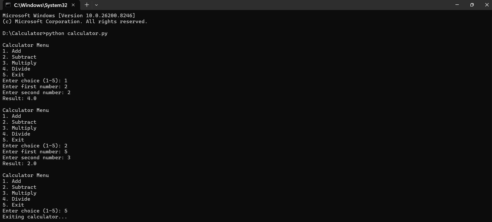

<div align="center">

# 🧮 Python CLI Calculator

### Transforming Basic Arithmetic into a Smooth Command-Line Experience

<p>


</p>

</div>

---

## 🌟 Introduction

The **Python CLI Calculator** is a sleek and interactive terminal-based calculator designed to perform everyday mathematical operations with speed and simplicity.

Built entirely using Python, this project demonstrates how core programming fundamentals can be used to create practical software that users can interact with directly from the command line.

It is simple for beginners, clean for developers, and flexible for future upgrades.

---

## 🎯 What Makes It Special?

✨ Minimal yet elegant design  
✨ Smooth menu navigation  
✨ Handles user mistakes intelligently  
✨ Safe division operation  
✨ Clean and readable Python code  
✨ Excellent beginner portfolio project

---

## 🚀 Visual Preview

<div align="center">

### 📷 Calculator Output Screenshot



</div>

---

## ⚙ Functionalities

<div align="center">

| Operation | Description |
|----------|-------------|
| ➕ Add | Sum of two numbers |
| ➖ Subtract | Difference between values |
| ✖ Multiply | Product of numbers |
| ➗ Divide | Safe division with zero handling |
| 🔁 Repeat | Continue calculations endlessly |
| ❌ Exit | Close application smoothly |

</div>

---

## 🛠 Built Using

```text
Language     : Python 3
Interface    : Command Line Interface
Editor       : VS Code / PyCharm / IDLE
Concepts     : Functions, Loops, Exception Handling